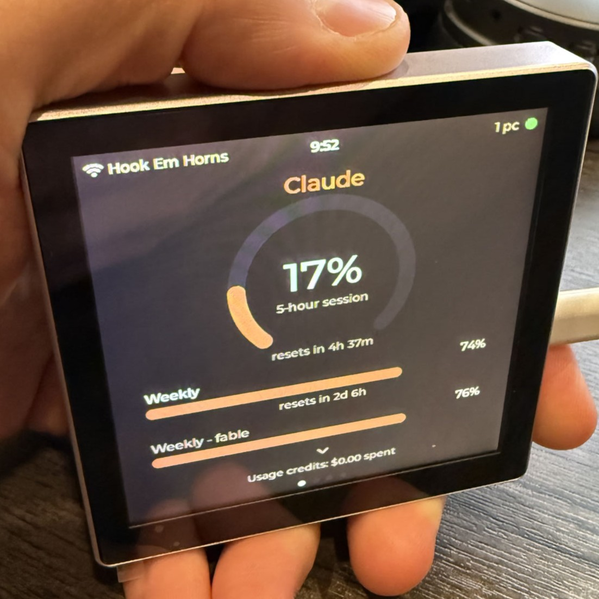
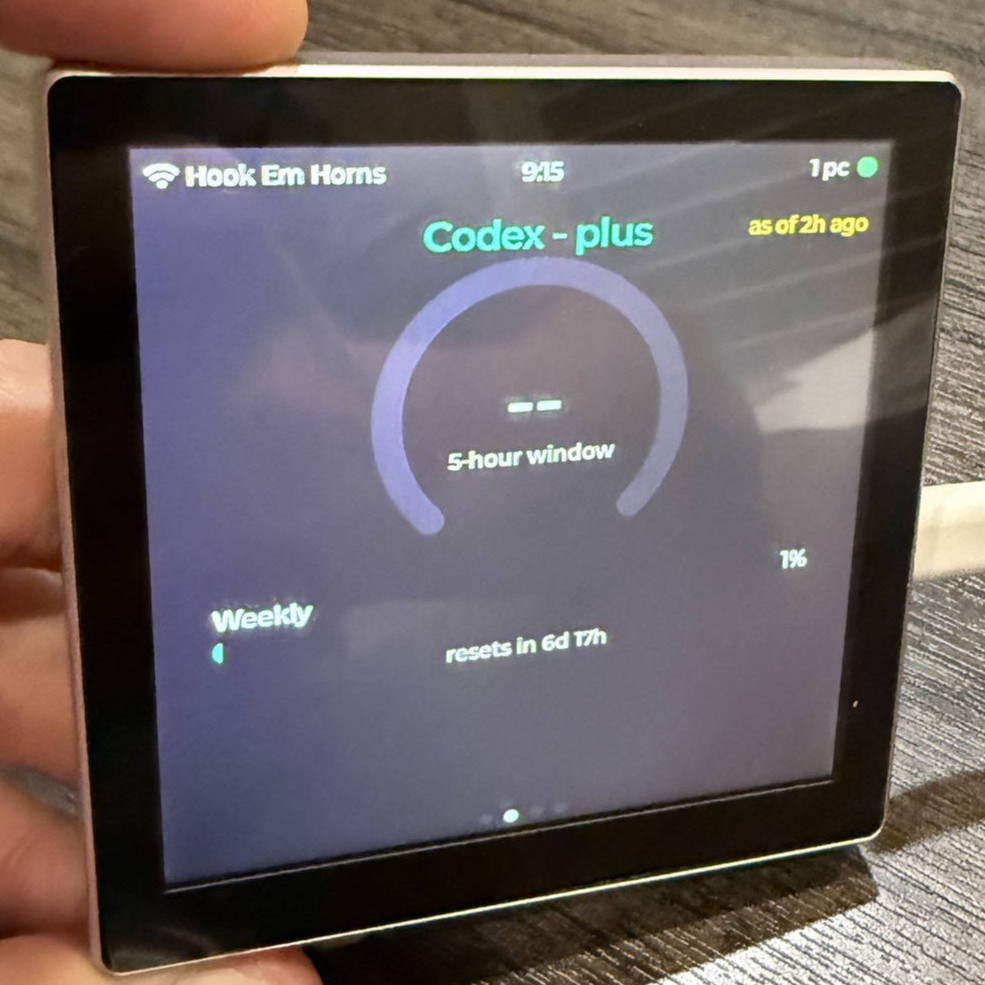
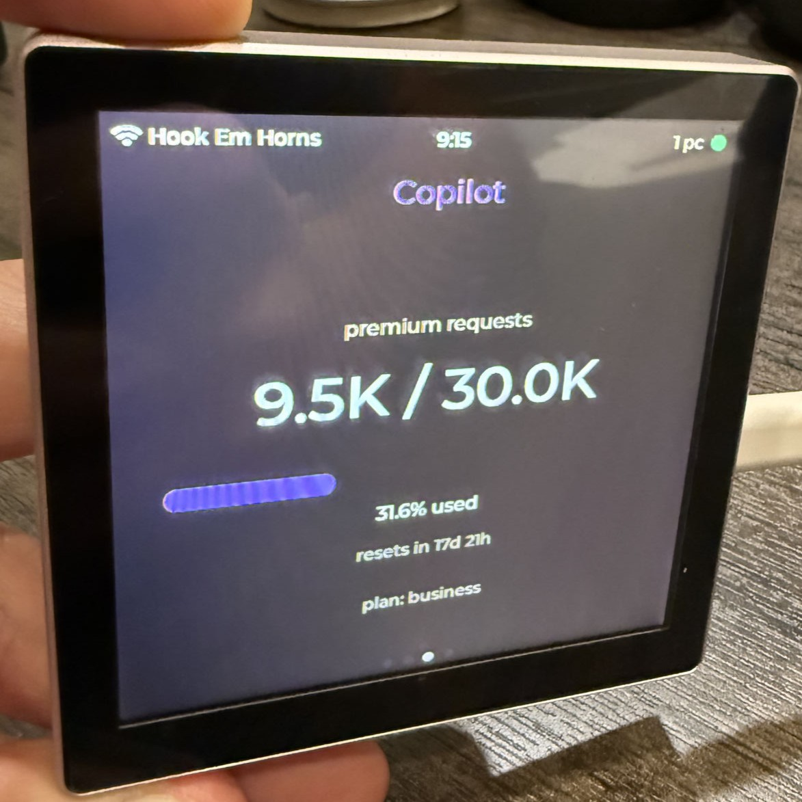

# usage-display

A desk display for AI subscription usage — **Claude**, **Codex**, and **GitHub Copilot** live on a 4" ESP32-S3 touch panel, updating in real time as you work.

| Claude | Codex | Copilot |
|---|---|---|
|  |  |  |

Built on the [Guition ESP32-4848S040](https://www.guition.com/esp32-display-module/4-inch-esp32s3-display-module) (480×480 IPS, capacitive touch, ESP32-S3 with 16MB flash / 8MB PSRAM).

## What it shows

- **Claude** — 5-hour session gauge, weekly + per-model weekly bars, reset countdowns, usage-credits spend; swipe down for token totals (today / 7-day / month / all-time, with estimated cost) summed across all your machines.
- **Codex** — 5-hour window and weekly limit gauges with resets.
- **Copilot** — premium requests used / included, monthly reset, plan.
- **Settings** — WiFi management on-device: scan, join via on-screen keyboard, saved-network list (remembers up to 8 networks and auto-joins the strongest — carry it between home and work).

Every screen carries a status bar (WiFi, clock, data-freshness dot, machine count) and honest staleness: data that stopped flowing gets an "as of Xm ago" chip instead of pretending to be live.

## How it works

```
[your machines]                       [Cloudflare]                    [ESP32 display]
usage-collector ──POST /v1/push──▶  Worker + Durable  ◀──GET /v1/summary── firmware
  every 30s        per-machine        Object              every 20s      LVGL UI
                   snapshots          merge at read:
                                      tokens summed,
                                      limits freshest-wins (clock-skew safe)
```

- [`collector/`](collector/) — zero-dependency Node.js daemon (systemd user service). Reads Claude Code's local transcript logs for token counts, and the CLIs' own credentials (read-only, never refreshes them) for account-wide limit percentages; Copilot quota via the same endpoint VS Code uses. Pushes snapshots to the relay.
- [`relay/`](relay/) — Cloudflare Worker + Durable Object (fits the free tier with ~10× headroom). Bearer-token auth both directions, per-machine snapshots merged at read time with clock-skew-safe freshness and stale-machine exclusion.
- [`firmware/`](firmware/) — PlatformIO / Arduino core 3.x / LVGL 9 / Arduino_GFX. ST7701 RGB panel with bounce-buffer + internal-RAM draw buffers (the ESP32-S3 WiFi/RGB coexistence dance), GT911 touch, multi-network WiFi state machine, TLS-pinned HTTPS polling on a dedicated core.

## Getting started

Each component has its own README with full setup:

1. **Relay** — [`relay/README.md`](relay/README.md): `wrangler deploy`, set two secrets, note your workers.dev URL.
2. **Collector** — [`collector/README.md`](collector/README.md): drop tokens into `~/.config/usage-collector/tokens.json`, run `install/install.sh` (systemd user service; one per machine you use).
3. **Firmware** — [`firmware/README.md`](firmware/README.md): copy `include/secrets.h.example` → `secrets.h` with your relay URL + read token, `pio run -t upload` (WSL2 flashing guide in [`firmware/docs/flashing-wsl2.md`](firmware/docs/flashing-wsl2.md)).

## Notes

- Token counts come from Claude Code's local JSONL transcripts (the same source tools like ccusage read); costs are estimates at API list prices.
- The device holds no vendor credentials — only a read token for your own relay.
- Design doc and implementation plans live in [`docs/superpowers/`](docs/superpowers/).
